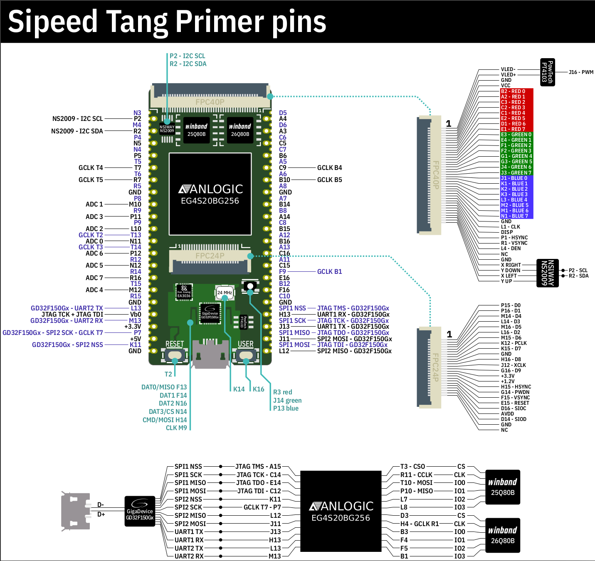

# SIPEED Tang Primer projects

## Software Development Environment
* Ubuntu 20.04 AMDx64
* Anlogic Tang Dynasty 4.6.2 IDE
* Saleae Logic 1.2.18
* Sigrok PulseView 0.5.0
* Cutecom 0.30.3

## Test Hardware
* Sipeed Tang Primer (Anlogic EG4S20BG256) FPGA development board
* PL2303HXD USB-UART adapter 
* Saleae8 Logic Analyzer clone
* OpenBench Logic Sniffer

