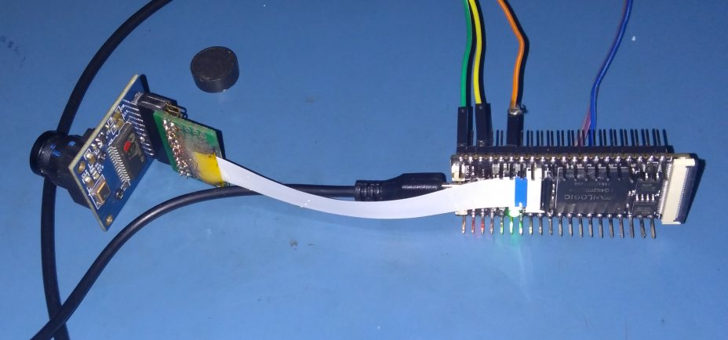
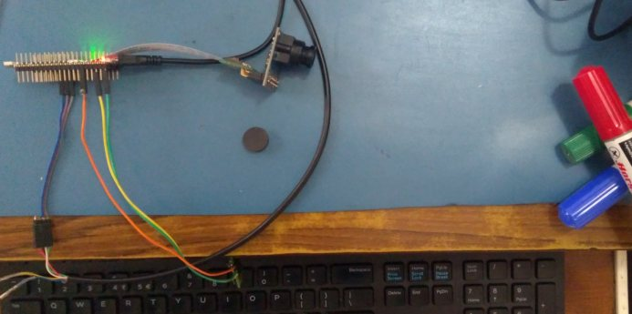
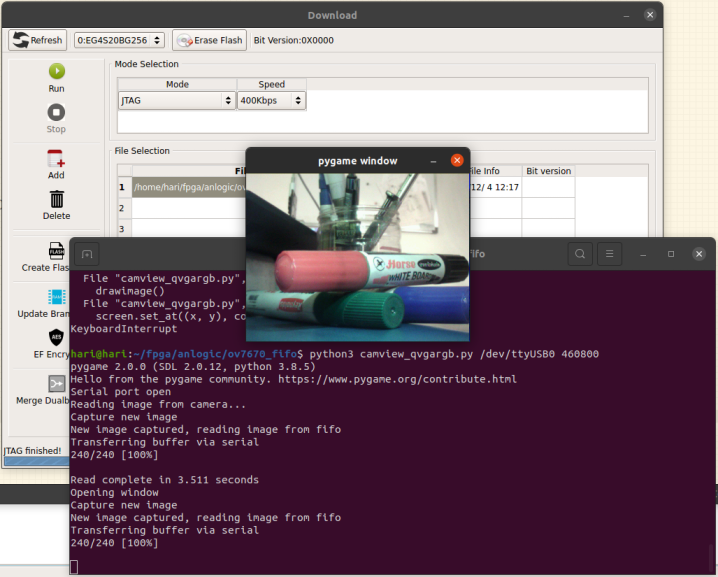

# Capturing images from an OV7670+AL422B camera module connected to SIPEED Tang Primer FPGA board

## Software Environment
* Ubuntu 20.04 AMDx86
* Anlogic Tang Dynasty 4.6.2 IDE, Verilog
* Python 3.8.5 with pygame and pyserial

## Hardware platform
* Sipeed Tang Primer (Anlogic EG4S20BG256) FPGA development board
* OV7670 + AL422B camera module
* PL2303HXD USB-UART adapter

## Notes
* Capture and display via Python GUI interface
* UART interface to FPGA board to control capture and readout at 460800baud
* Camera configured for QVGA RGB565 (16bits per pixel, 320 x 240)
* Camera module pinout wiring details. This is specific to the module I have, there are versions with different pinouts.
    * WRST_ connected to VSYNC (VSYNC must be configured as active-low). This automatically resets the AL422B FIFO write
    pointer on every VSync pulse.
    * PDN and OE connected to GND
    * HREF and STR unconnected
    * 4K7 pullup resistors from SIOC, SIOD to 3.3V
    * 22K pullup resistor from RST_ to 3.3V
* Homebrew adapter from 0.5mm pitch FPC-24pin connector to the camera module connector
```

OV7670_AL422B Module Pinout
---------------------------
GND     3V3
SIOD    SIOC
HREF    VSYNC
D6      D7
D4      D5
D2      D3
D9      D1
PDN     RST_
RCK     STR
OE      WREN
RRST_   WRST_


    
FPC24  <->  OV7670_AL422B
-------------------------
1 P15	    RCK
2 P16	    WREN
3 M14	    D2
4 L14	    D1
5 M16	    D3
6 L16	    D0
7 M15	    D4
8 K12	    --
9 K15	    D5
10 GND	    GND
11 H16	    D6
12 J12	    --
13 G16	    D7
14 3V3	    3V3
15 1V2	    --
16 H15	    --
17 G14	    RRST_
18 F15	    VSYNC
19 E15	    RST_
20 D16	    SIOC
21 AVDD    --
22 D14	    SIOD
23 GND	    GND
24 NC	    --

```






