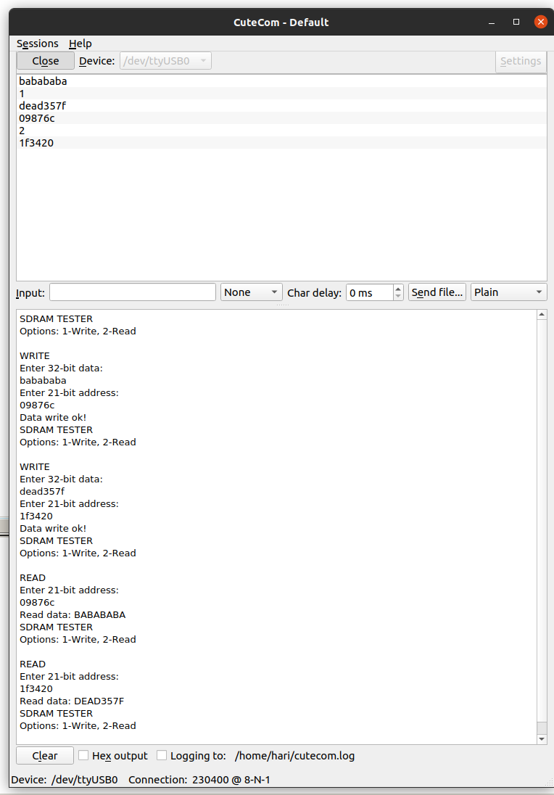

# SIPEED_TANG_PRIMER_SDRAM_TEST

Verilog code to demonstrate Anlogic EG4S20 internal 64Mb SDRAM read/write.
The SDRAM is configured as a 2M x 32b memory.

I was able to get 32bit read/writes working with the SDRAM clocked 
at up to 168MHz. The top level, uart and tester modules are clocked 
with the onboard 24MHz crystal oscillator.

Read/write tested via uart serial terminal @ 230400baud.

## Serial terminal test session

## Credits

* [SDRAM controller](https://github.com/ReinForce-II/anlogic_eg4s_sdram_controller)
* [SDRAM tester](https://www.hackster.io/salvador-canas/a-practical-introduction-to-sdr-sdram-memories-using-an-fpga-8f5949)
* [UART rx and tx](https://www.nandland.com/vhdl/modules/module-uart-serial-port-rs232.html)
